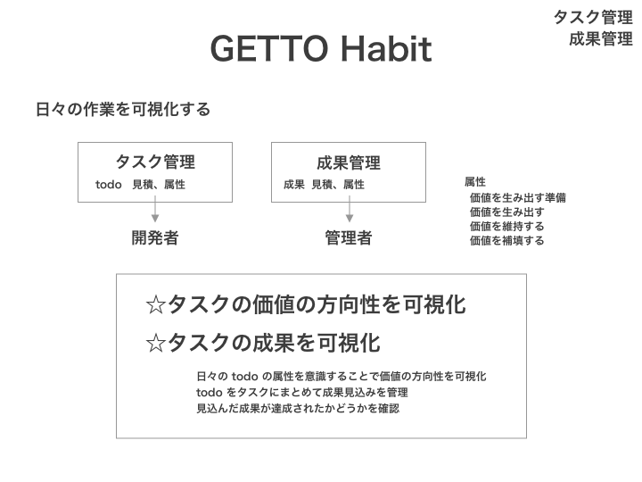
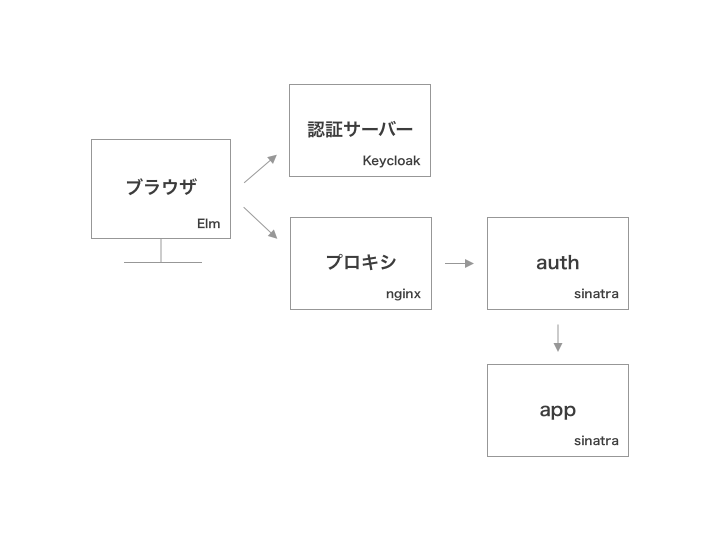

# インセプションデッキ

- 経緯 : 日々作業が発生してはこなしている
- 目的 : それぞれの作業がどんな価値を生み出しているのかまとめる
- 状況 : 他のプロジェクトは k8s クラスタにデプロイしていて、今後は Keycloak でシングルサインオンしたい
- 決定 : Keycloak の Realm ごとにインスタンスをデプロイする

###### TODOS

- システムアーキテクチャを作成

###### Table of Contents

- [我々はぜここにいるのか？](#user-content-我々はぜここにいるのか？)
- [エレベーターピッチ](#user-content-エレベーターピッチ)
- [関係者](#user-content-関係者)
- [夜も眠れない問題](#user-content-夜も眠れない問題)
- [やること、やらないこと、あとで決めること](#user-content-やること、やらないこと、あとで決めること)
- [システムアーキテクチャ](#user-content-システムアーキテクチャ)
- [タイムライン](#user-content-タイムライン)
- [トレードオフスライダー](#user-content-トレードオフスライダー)
- [必要な費用](#user-content-必要な費用)

## 我々はぜここにいるのか？

- 日々のタスクがどのような価値を生み出しているのかがわかるようにする

## エレベーターピッチ

[エレベーターピッチ](https://sketch.cloud/s/vaybQ/dlW4WGl)

## 関係者

- 開発者
- 管理者

## 夜も眠れない問題

- 成果がきっちり測れないかもしれない

## やること、やらないこと、あとで決めること

### やること

- todo リスト

### やらないこと

- 週ごと、月ごとの作業時間集計
- 週ごと、月ごとの成果集計

### あとで決めること

- 集計を追加する時期
- グラフを追加する時期

## システムアーキテクチャ

[システムアーキテクチャ](https://sketch.cloud/s/vaybQ/zxbjbpy)

## タイムライン

- 2019/01 w14 : todo リストリリース予定

## トレードオフスライダー

### 基本

- `#---------` : スコープ
- `#---------` : 予算
- `##########` : 時間
- `##########` : 品質

### 重要事項

- `######----` : タスクの価値の可視化
- `##########` : タスクの成果の可視化

## 必要な費用

- ノード +1 : 2,000円 / month

### 根拠

- getto-union にデプロイ
- auth + app => node +1
